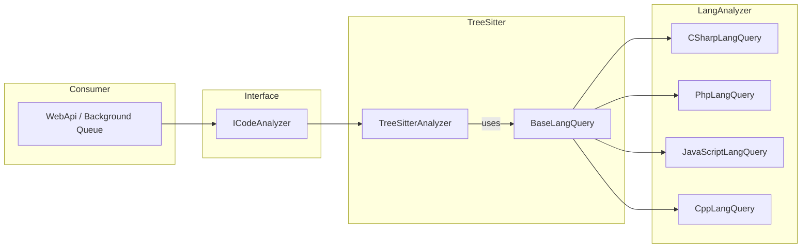

# Walkthrough: Modul Analisis Kode Sumber — Tree-Sitter Two-Pass

## Ringkasan

Dibangun modul analisis kode sumber di `Github-Analyzer.Analysis` yang menggunakan Tree-Sitter untuk parsing statis. Modul menerima `CodebaseSnapshot` (dari codebase reader) dan menghasilkan `CodeGraph` melalui algoritma dua-fase dengan progress streaming.

- **14 file baru** dibuat
- **1 file** dimodifikasi (ICodeAnalyzer.cs)
- **5 file** dihapus (Service/, ICodeParser.cs)
- **Build**: ✅ 0 warnings, 0 errors

---

## Arsitektur



**Pemisahan tanggung jawab:**
- **BaseLangQuery** → query node tree-sitter per bahasa (Template Method)
- **TreeSitterAnalyzer** → analisa relasi dua-fase (Declaration Mapping + Usage Scanning)
- **LangAnalyzer/** → implementasi query spesifik bahasa (C#, PHP, JS, C++)
- **QueryDefinitions/** → S-expression query strings per grammar

---

## File Yang Dibuat/Diubah

### Dihapus
| File | Alasan |
|------|--------|
| `Service/CodeAnalysisService.cs` | Diganti TreeSitterAnalyzer |
| `Service/TreeSitterAnalyzer.cs` | Arsitektur lama |
| `Service/TreeSitterParser.cs` | Diganti ParserPool |
| `Service/JsonSerializerService.cs` | Tidak relevan lagi |
| `Interface/ICodeParser.cs` | Tidak dipakai |

### Dimodifikasi
| File | Perubahan |
|------|-----------|
| [ICodeAnalyzer.cs](file:///f:/Coding/Project%20Web/Github-Analyzer/src/Github-Analyzer.Analysis/Interface/ICodeAnalyzer.cs) | Signature diubah ke `IAsyncEnumerable<TreeSitterProgress<CodeGraph>>` |

### Dibuat Baru

#### Domain Layer
| File | Deskripsi |
|------|-----------|
| [AnalysisLanguage.cs](file:///f:/Coding/Project%20Web/Github-Analyzer/src/Github-Analyzer.Analysis/Domain/TreeSitter/AnalysisLanguage.cs) | Enum: CSharp, JavaScript, Php, Cpp |
| [TreeSitterProgress.cs](file:///f:/Coding/Project%20Web/Github-Analyzer/src/Github-Analyzer.Analysis/Domain/TreeSitter/TreeSitterProgress.cs) | Generic progress model untuk streaming |
| [LangQueryData.cs](file:///f:/Coding/Project%20Web/Github-Analyzer/src/Github-Analyzer.Analysis/Domain/TreeSitter/LangQueryData.cs) | LangQueryResult + 6 info records |

#### TreeSitter Core
| File | Deskripsi |
|------|-----------|
| [TreeSitterAnalyzer.cs](file:///f:/Coding/Project%20Web/Github-Analyzer/src/Github-Analyzer.Analysis/TreeSitter/TreeSitterAnalyzer.cs) | Main analyzer — two-pass relation analysis |
| [BaseLangQuery.cs](file:///f:/Coding/Project%20Web/Github-Analyzer/src/Github-Analyzer.Analysis/TreeSitter/BaseLangQuery.cs) | Abstract base — template method for queries |

#### Utils
| File | Deskripsi |
|------|-----------|
| [ParserPool.cs](file:///f:/Coding/Project%20Web/Github-Analyzer/src/Github-Analyzer.Analysis/TreeSitter/Utils/ParserPool.cs) | Language/Parser lifecycle management |
| [PathId.cs](file:///f:/Coding/Project%20Web/Github-Analyzer/src/Github-Analyzer.Analysis/TreeSitter/Utils/PathId.cs) | PathId builder utilities |

#### Query Definitions
| File | Bahasa |
|------|--------|
| [CSharpQueries.cs](file:///f:/Coding/Project%20Web/Github-Analyzer/src/Github-Analyzer.Analysis/TreeSitter/QueryDefinitions/CSharpQueries.cs) | C# |
| [PhpQueries.cs](file:///f:/Coding/Project%20Web/Github-Analyzer/src/Github-Analyzer.Analysis/TreeSitter/QueryDefinitions/PhpQueries.cs) | PHP |
| [JavaScriptQueries.cs](file:///f:/Coding/Project%20Web/Github-Analyzer/src/Github-Analyzer.Analysis/TreeSitter/QueryDefinitions/JavaScriptQueries.cs) | JavaScript |
| [CppQueries.cs](file:///f:/Coding/Project%20Web/Github-Analyzer/src/Github-Analyzer.Analysis/TreeSitter/QueryDefinitions/CppQueries.cs) | C++ |

#### Language Analyzers
| File | Bahasa | UsesNamespace |
|------|--------|---------------|
| [CSharpLangQuery.cs](file:///f:/Coding/Project%20Web/Github-Analyzer/src/Github-Analyzer.Analysis/TreeSitter/LangAnalyzer/CSharpLangQuery.cs) | C# | ✅ |
| [PhpLangQuery.cs](file:///f:/Coding/Project%20Web/Github-Analyzer/src/Github-Analyzer.Analysis/TreeSitter/LangAnalyzer/PhpLangQuery.cs) | PHP | ✅ |
| [JavaScriptLangQuery.cs](file:///f:/Coding/Project%20Web/Github-Analyzer/src/Github-Analyzer.Analysis/TreeSitter/LangAnalyzer/JavaScriptLangQuery.cs) | JavaScript | ❌ (folder) |
| [CppLangQuery.cs](file:///f:/Coding/Project%20Web/Github-Analyzer/src/Github-Analyzer.Analysis/TreeSitter/LangAnalyzer/CppLangQuery.cs) | C++ | ✅ |

---

## Algoritma Two-Pass

### Pass 1: Declaration Mapping (0–60%)
Per file:
1. Parse source code via `BaseLangQuery.ExtractAll()`
2. Build folder/namespace hierarchy nodes
3. Create File, Class, Function nodes
4. Create SourceRelEdges: Root → Folder/NS → File → Class → Function
5. Collect declarations indexed by name

### Pass 2: Usage Scanning (60–100%)
Per file (reusing Pass 1 results):
1. Untuk setiap call/type reference, resolve ke deklarasi
2. **Scope Resolution** (konservatif):
   - Same file → match langsung
   - Same namespace → match jika unik
   - Global → match jika hanya 1 kandidat
   - Ambiguous → skip
3. Create UseRelEdges (EdgeType.Call)

---

## Background Queue Support

- `CancellationToken` checked setiap iterasi file
- `[EnumeratorCancellation]` attribute pada parameter
- `await Task.Yield()` setelah setiap file untuk non-blocking
- `IDisposable` pada semua resource (Parser, Language)
- No shared mutable state — setiap call independen

---

## Catatan untuk Integrasi

> [!WARNING]
> WebApi masih punya referensi ke code lama yang dihapus:
> - `Program.cs` → `ICodeParser`, `TreeSitterParser`, `CodeAnalysisService`, `JsonSerializerService`
> - `AnalysisService.cs` → `CodeAnalysisService`
> - `AnalysisEndpoint.cs` → `CodeAnalysisService`
>
> Ini perlu di-update saat integrasi dengan WebApi/WebApp di fase berikutnya.

## Validasi

```
dotnet build Github-Analyzer.Analysis.csproj
Build succeeded. 0 Warning(s), 0 Error(s)
```
